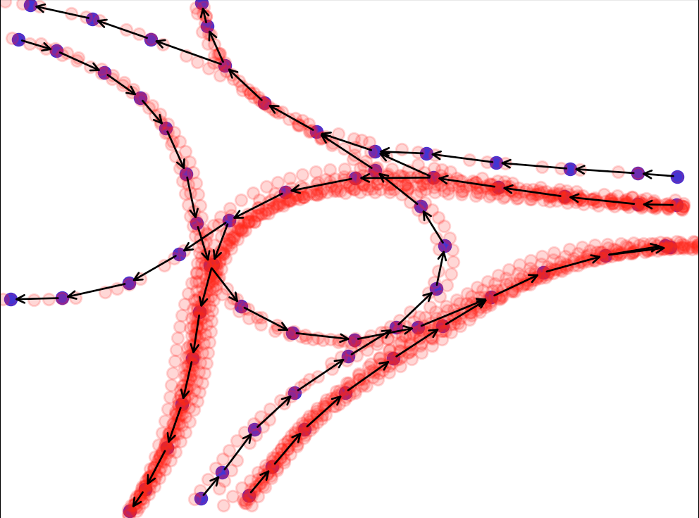

# graphgen

This repository is a collection of the code I wrote while researching with the [Mechanical Systems Control Lab](https://msc.berkeley.edu/). The goal is to generate routable graphs from collections of GPS traces from the [INTERACTION dataset](http://interaction-dataset.com/).

## Algorithms/Results

We first perform preprocessing on the data. The data is divided into GPS traces and inaccurate traces are discarded. Next, the traces are classified into their respective lanes. As of now, this classification is done manually. After classification, the graph generation algorithm presented by [Cao and Krumm](https://www.microsoft.com/en-us/research/wp-content/uploads/2016/12/maps-from-GPS.pdf) is used to generate a directed graph representing the road network.

Below is an example of a generated graph overlaid on the raw GPS traces:

## Improvements
There are still many improvements to be made:

- Cleaning up graph where multiple roads merge or split
- Improving upon preprocessing of data
- Conduct lots of testing to determine optimal parameters
